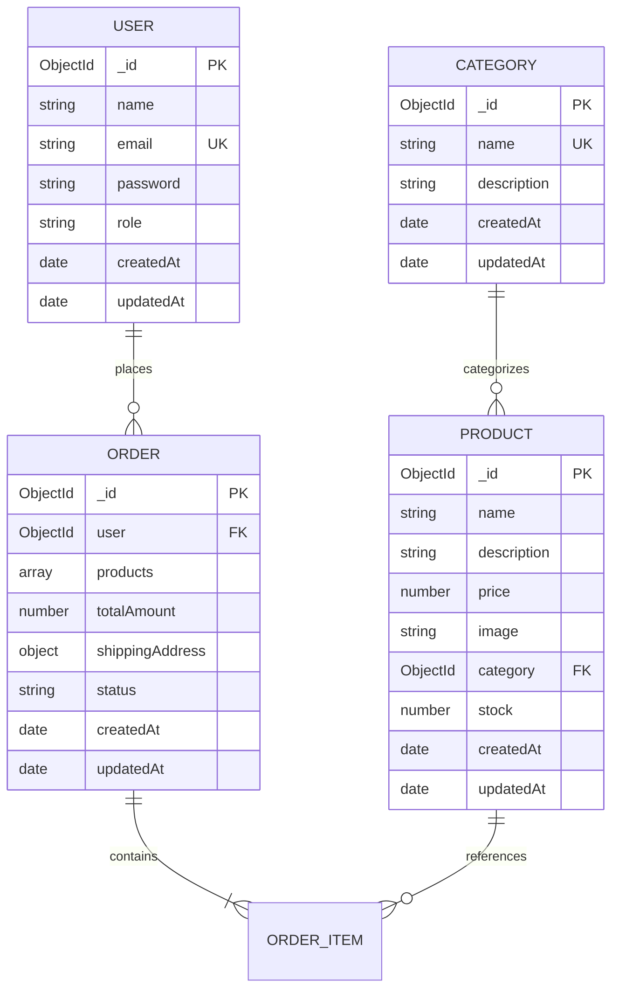

# 🗄️ Database Design & Mongoose Schemas

This document defines the data models, relationship diagrams, field validation constraints, and indexes for the **MongoDB** database in the Mini E-Commerce project.

---

## 1. Entity Relationship Diagram (ERD)



---

## 2. Models Specification

### 2.1 User Model (`models/User.js`)

Represents registered customers and administrative accounts.

```javascript
const userSchema = new mongoose.Schema(
  {
    name: {
      type: String,
      required: [true, "Name is required"],
      trim: true,
      minlength: [2, "Name must be at least 2 characters long"],
      maxlength: [50, "Name cannot exceed 50 characters"],
    },
    email: {
      type: String,
      required: [true, "Email is required"],
      unique: true,
      trim: true,
      lowercase: true,
      match: [
        /^\w+([.-]?\w+)*@\w+([.-]?\w+)*(\.\w{2,3})+$/,
        "Please provide a valid email address",
      ],
    },
    password: {
      type: String,
      required: [true, "Password is required"],
      minlength: [6, "Password must be at least 6 characters long"],
      select: false, // Omitted by default in queries for security
    },
    role: {
      type: String,
      enum: {
        values: ["customer", "admin"],
        message: "Role must be either 'customer' or 'admin'",
      },
      default: "customer",
    },
  },
  {
    timestamps: true,
  }
);
```

#### User Indexes & Hooks
- **Unique Index**: `{ email: 1 }`
- **Pre-save Hook**: Hashes password using `bcrypt.hash(password, 10)` when modified.
- **Instance Method**: `matchPassword(enteredPassword)` compares plaintext against stored hash using `bcrypt.compare`.

---

### 2.2 Category Model (`models/Category.js`)

Defines merchandise categories created and maintained by admins.

```javascript
const categorySchema = new mongoose.Schema(
  {
    name: {
      type: String,
      required: [true, "Category name is required"],
      unique: true,
      trim: true,
      minlength: [2, "Category name must be at least 2 characters"],
      maxlength: [50, "Category name cannot exceed 50 characters"],
    },
    description: {
      type: String,
      required: [true, "Category description is required"],
      trim: true,
      maxlength: [500, "Description cannot exceed 500 characters"],
    },
  },
  {
    timestamps: true,
  }
);
```

#### Category Indexes
- **Unique Index**: `{ name: 1 }`

---

### 2.3 Product Model (`models/Product.js`)

Stores item listings in the catalog.

```javascript
const productSchema = new mongoose.Schema(
  {
    name: {
      type: String,
      required: [true, "Product name is required"],
      trim: true,
      minlength: [2, "Product name must be at least 2 characters long"],
      maxlength: [120, "Product name cannot exceed 120 characters"],
    },
    description: {
      type: String,
      required: [true, "Product description is required"],
      trim: true,
      maxlength: [2000, "Description cannot exceed 2000 characters"],
    },
    price: {
      type: Number,
      required: [true, "Product price is required"],
      min: [0.01, "Price must be greater than zero"],
    },
    image: {
      type: String,
      required: [true, "Product image URL is required"],
      trim: true,
    },
    category: {
      type: mongoose.Schema.Types.ObjectId,
      ref: "Category",
      required: [true, "Product must belong to a category"],
    },
    stock: {
      type: Number,
      required: [true, "Stock quantity is required"],
      min: [0, "Stock cannot be negative"],
      default: 0,
      validate: {
        validator: Number.isInteger,
        message: "Stock must be an integer",
      },
    },
  },
  {
    timestamps: true,
  }
);
```

#### Product Indexes
- **Index**: `{ category: 1 }`
- **Text Index**: `{ name: "text", description: "text" }` (Supports keyword searching)

---

### 2.4 Order Model (`models/Order.js`)

Stores order placement records, shipping destinations, snapshots of purchased products, and lifecycle statuses.

```javascript
const orderItemSchema = new mongoose.Schema({
  product: {
    type: mongoose.Schema.Types.ObjectId,
    ref: "Product",
    required: true,
  },
  name: {
    type: String,
    required: true,
  },
  price: {
    type: Number,
    required: true,
  },
  quantity: {
    type: Number,
    required: true,
    min: [1, "Quantity must be at least 1"],
  },
  image: {
    type: String,
    required: false,
  },
});

const shippingAddressSchema = new mongoose.Schema({
  name: {
    type: String,
    required: [true, "Recipient name is required"],
    trim: true,
  },
  phone: {
    type: String,
    required: [true, "Phone number is required"],
    trim: true,
  },
  address: {
    type: String,
    required: [true, "Street address is required"],
    trim: true,
  },
  city: {
    type: String,
    required: [true, "City is required"],
    trim: true,
  },
  pincode: {
    type: String,
    required: [true, "Pincode is required"],
    trim: true,
  },
});

const orderSchema = new mongoose.Schema(
  {
    user: {
      type: mongoose.Schema.Types.ObjectId,
      ref: "User",
      required: true,
    },
    products: {
      type: [orderItemSchema],
      required: true,
      validate: [
        (val) => val.length > 0,
        "Order must contain at least one item",
      ],
    },
    totalAmount: {
      type: Number,
      required: true,
      min: [0, "Total amount cannot be negative"],
    },
    shippingAddress: {
      type: shippingAddressSchema,
      required: true,
    },
    paymentMethod: {
      type: String,
      default: "Cash on Delivery",
      immutable: true,
    },
    status: {
      type: String,
      enum: {
        values: ["Pending", "Confirmed", "Shipped", "Delivered", "Cancelled"],
        message: "Status must be: Pending, Confirmed, Shipped, Delivered, or Cancelled",
      },
      default: "Pending",
    },
  },
  {
    timestamps: true,
  }
);
```

#### Order Indexes
- **Compound Index**: `{ user: 1, createdAt: -1 }` (Accelerates user order history lookups)
- **Status Index**: `{ status: 1 }` (Accelerates admin order filtering)

---

## 3. Data Integrity & Constraints Summary

| Model | Field | Constraint / Rule |
| :--- | :--- | :--- |
| **User** | `email` | Unique, lowercase, valid regex format |
| **User** | `password` | Min 6 chars, hashed via bcrypt |
| **User** | `role` | Restricted to `["customer", "admin"]` |
| **Category** | `name` | Unique, trimmed, required |
| **Product** | `price` | Strictly positive (`> 0`) |
| **Product** | `stock` | Integer, non-negative (`>= 0`) |
| **Product** | `category` | Valid ObjectId referencing `Category` |
| **Order** | `products` | Non-empty array, item price snapshot preserved |
| **Order** | `totalAmount` | Recomputed server-side from live DB prices |
| **Order** | `status` | Restricted enum transition states |
