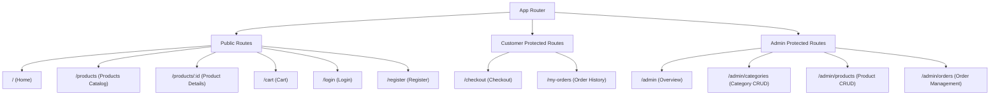

# 🎨 Frontend UI/UX & Component Specification

This document details the frontend architecture, page routing, state management, UI component structure, and user interaction rules for the **React + Vite + Tailwind CSS** client.

---

## 1. Application Routing & Route Protection



### Route Guards
- `<ProtectedRoute>`: Checks if `user` exists in `AuthContext`. If unauthenticated, redirects to `/login` with `from` location state.
- `<AdminRoute>`: Checks if `user && user.role === 'admin'`. If unauthorized, redirects to `/` with an error toast message.

---

## 2. Global State Management

The frontend utilizes lightweight, native React Contexts to avoid unnecessary boilerplate:

### 2.1 `AuthContext`
- **State**:
  - `user`: `{ _id, name, email, role }` or `null`
  - `token`: JWT string persisted in `localStorage`
  - `loading`: Boolean during initial token verification
- **Methods**:
  - `login(email, password)`
  - `register({ name, email, password, confirmPassword })`
  - `logout()`: Clears token, user state, and resets active cart

### 2.2 `CartContext`
- **State**:
  - `cartItems`: Array of `{ product: { _id, name, price, image, stock }, quantity }`
  - Persisted to `localStorage` under key `ecom_cart`
- **Calculated Properties**:
  - `totalItems`: Total sum of all item quantities
  - `totalPrice`: Computed sum of `(price * quantity)`
- **Methods**:
  - `addToCart(product, quantity = 1)`: Enforces `quantity <= product.stock`
  - `updateQuantity(productId, newQuantity)`: Clamps `1 <= newQuantity <= product.stock`
  - `removeFromCart(productId)`
  - `clearCart()`: Empties cart upon successful checkout

### 2.3 `ToastContext`
- Lightweight feedback notifications (`success`, `error`, `info`, `warning`) automatically dismissed after 3500ms.

---

## 3. Page Specifications

### 3.1 Storefront Pages

#### A. Home (`/`)
- **Hero Banner**: Engaging welcome title, call-to-action button linking to `/products`.
- **Featured Categories**: Quick-navigation badges for active categories.
- **Featured Products**: Grid of latest 4-8 products with quick "Add to Cart" triggers.

#### B. Products Catalog (`/products`)
- **Search Bar**: Debounced input filtering by product name.
- **Category Filter Chips**: `All | Electronics | Fashion | Shoes | ...` with active highlighting.
- **Product Grid**: Responsive 1 / 2 / 3 / 4-column card grid depending on screen width.
- **Empty State**: Friendly illustration and message when no products match criteria.

#### C. Product Details (`/products/:id`)
- **Image Showcase**: Clean card presentation with full product preview.
- **Meta Information**: Title, category tag, detailed description, and price.
- **Inventory Status**:
  - In Stock: Displays available count.
  - Out of Stock: Red badge; "Add to Cart" button is disabled.
- **Quantity Selector**: Plus/minus counter respecting available stock limits.

#### D. Cart (`/cart`)
- **Item Rows**: Thumbnail, title, unit price, quantity increment/decrement, line total, and remove icon.
- **Stock Limit Guard**: Plus button disables when reaching product stock.
- **Summary Sidebar**: Subtotal, Shipping (Free), Total amount, and "Proceed to Checkout" button.
- **Empty Cart State**: "Your cart is empty" prompt with a direct link to the store.

#### E. Checkout (`/checkout`)
- **Customer Form**:
  - Full Name
  - Phone Number
  - Shipping Address
  - City
  - Pincode
- **Payment Method**: Radio option fixed to **Cash on Delivery (COD)**.
- **Order Review**: Summary of purchased items and total price to be paid upon delivery.
- **Submission Action**: Validates fields, triggers `POST /api/orders`, decrements stock, clears cart, and routes to `/my-orders`.

#### F. My Orders (`/my-orders`)
- **Order Cards**: Listing user's past purchases sorted newest first.
- **Status Badges**: Distinct Tailwind color treatments:
  - `Pending` (Amber)
  - `Confirmed` (Blue)
  - `Shipped` (Indigo)
  - `Delivered` (Green)
  - `Cancelled` (Red)
- **Itemized Breakdown**: List of products, quantities, prices, and shipping address.

---

## 4. Admin Dashboard Specifications

The Admin Panel features a responsive fixed sidebar layout:
- **Desktop**: Left fixed sidebar (240px) + content area.
- **Mobile**: Collapsible hamburger sidebar drawer with backdrop.

### 4.1 Admin Categories (`/admin/categories`)
- **Add / Edit Modal**: Form fields for `name` and `description`.
- **Data Table**: Columns for Name, Description, Actions (Edit, Delete).
- **Delete Confirmation Modal**: Prevents accidental clicks and checks for product dependencies.

### 4.2 Admin Products (`/admin/products`)
- **Add / Edit Modal**:
  - Product Name (Input)
  - Category (Dropdown populated from DB)
  - Price (Number input, min 0.01)
  - Stock (Number input, min 0)
  - Image URL (Input with live thumbnail preview)
  - Description (Textarea)
- **Product Table**: Thumbnail, Name, Category, Price, Stock count (with low-stock highlight if < 5), Actions (Edit, Delete).

### 4.3 Admin Orders (`/admin/orders`)
- **Overview Table**: Order ID, Customer Name, Date, Total Amount, Current Status, Actions.
- **Status Dropdown / Modal**: Quick status changer between `Pending`, `Confirmed`, `Shipped`, `Delivered`, `Cancelled`.
- **Order Detail Drawer**: Inspects full shipping address, contact phone, and product snapshots.

---

## 5. UI Components Breakdown

```
src/components/
├── common/
│   ├── Button.jsx             # Primary, secondary, danger, ghost variants with loading spinner
│   ├── Input.jsx              # Label, error message, helper text support
│   ├── Modal.jsx              # Reusable accessible dialog with backdrop
│   ├── ConfirmDialog.jsx      # Specialized deletion confirmation dialog
│   ├── Badge.jsx              # Status colors (Pending, Confirmed, Shipped, Delivered, Cancelled)
│   ├── Loader.jsx             # Full-page and inline spinner components
│   └── EmptyState.jsx         # Uniform message & icon for empty data sets
├── layout/
│   ├── Navbar.jsx             # Brand logo, search link, cart counter badge, auth dropdown
│   ├── Footer.jsx             # Minimalist copyright and links
│   └── AdminSidebar.jsx       # Navigation links (Categories, Products, Orders, Return to Store)
└── product/
    ├── ProductCard.jsx        # Image, Title, Price, Category tag, Add-to-Cart button
    ├── ProductGrid.jsx        # CSS grid responsive wrapper
    └── CategoryFilter.jsx     # Chip scrollable / wrap button group
```

---

## 6. Tailwind CSS Styling Tokens & Guidelines

- **Color Palette**:
  - Primary: `slate-900` / `blue-600` (Modern professional corporate)
  - Background: `bg-gray-50` for storefront, `bg-slate-100` for admin
  - Surface: `bg-white` with `shadow-sm` and `border border-gray-200`
  - Success: `emerald-600`
  - Warning: `amber-500`
  - Danger: `rose-600`
- **Typography**: Clean system font stack or Inter font family.
- **Responsive Breakpoints**:
  - Mobile: `< 640px` (Single column, hidden sidebar)
  - Tablet: `640px - 1024px` (2-column grids)
  - Desktop: `> 1024px` (3 to 4-column grids, fixed admin sidebar)
